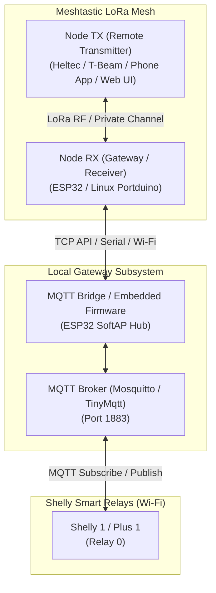

# Architecture & Technical Requirements: Meshtastic to MQTT (Shelly Smart Relay) Control

This document outlines the architecture, data structures, and security specifications for using a **Meshtastic LoRa node** to wirelessly control **Shelly smart relays** over MQTT via a Gateway node.

---

## 1. System Architecture



---

## 2. Technical Requirements & Security Design

### A. Data Structure (Payload Specification)
To keep LoRa payload sizes minimal (< 200 bytes) while enabling full validation and feedback, use compact JSON structures over a private channel (e.g. `SERIAL_APP` or `TEXT_MESSAGE_APP`).

#### Command Payload (Node TX ➔ Node RX)
```json
{
  "ver": 1,
  "target": "shelly1-sim01",
  "action": "ON",
  "seq": 1042,
  "sig": "9b9a4221"
}
```
* **`ver`**: Protocol version integer.
* **`target`**: Identifier of target device connected to MQTT broker.
* **`action`**: `ON`, `OFF`, or `TOGGLE`.
* **`seq`**: Monotonic counter / timestamp for anti-replay verification.
* **`sig`**: Truncated hex HMAC signature computed over `target + action + seq` with a shared secret key.

#### Response / Status ACK Payload (Node RX ➔ Node TX)
```json
{
  "ver": 1,
  "target": "shelly1-sim01",
  "state": "ON",
  "ack_seq": 1042,
  "status": "OK"
}
```

---

### B. Security & Verification Pipeline

1. **Sender Node ID Whitelist**:
   - Gateway verifies `FromRadio.from` equals Node TX's exact 32-bit Node ID.
2. **HMAC Signature (Cryptographic Authorization)**:
   - Node TX and Gateway share a secret key `CONTROL_SECRET`.
   - Node TX computes `sig = Truncate8(HMAC_SHA256(CONTROL_SECRET, "shelly1-sim01:ON:1042"))`.
   - Gateway recalculates HMAC and drops request if signatures do not match.
3. **Anti-Replay Protection (Nonce / Sequence Tracking)**:
   - Gateway stores `last_seen_seq` per Node ID.
   - If `seq <= last_seen_seq`, packet is rejected as a duplicate or replay attack.

---

### C. Shelly Smart Relay MQTT Integration

#### Shelly Standard Topics:
* **Shelly Gen 1 (e.g. Shelly 1/1PM)**:
  * Command Topic: `shellies/shelly1-<device_id>/relay/0/command` (Payload: `on` or `off`)
  * State Topic: `shellies/shelly1-<device_id>/relay/0` (Payload: `on` or `off`)
* **Shelly Gen 2 / Plus Series (RPC Protocol)**:
  * Command Topic: `<device_id>/rpc` (Payload: `{"id":1,"src":"meshtastic","method":"Switch.Set","params":{"id":0,"on":true}}`)
  * Status Topic: `<device_id>/status/switch:0` (Payload: `{"output":true,...}`)

---

## 3. Automated 1-Click Provisioning (.env Supported)

To configure both simulated containers or real physical USB hardware in one click:

```bash
# 1. Setup local environment
cp .env.example .env

# 2. Auto-provision all simulated nodes (RX & TX)
.venv/bin/python3 meshtasticd-config/provision_nodes.py --sim

# 3. Auto-provision physical hardware node via USB
.venv/bin/python3 meshtasticd-config/provision_nodes.py --serial /dev/ttyUSB0 --role rx
```

---

## 4. Current Status & Verification Table

| Component | Status | Verification Details |
| :--- | :--- | :--- |
| **HMAC-SHA256 Auth** | ✅ Verified | Truncated hex signature verified against shared secret |
| **Anti-Replay Counter** | ✅ Verified | Reused/stale sequence numbers rejected |
| **Shelly Simulator** | ✅ Verified | Toggles relay state and emits Gen 1 / Gen 2 topics on `1883` |
| **Mesh Status ACK** | ✅ Verified | Bidirectional acknowledgment returned over mesh |
| **Automated Provisioning**| ✅ Verified | Reads `.env`, sets names, LoRa region, and MQTT module |
| **Simulated RF Cross-Routing** | ✅ Verified | `meshtasticd-config/sim_rf_bridge.py` cross-relays `SIMULATOR_APP` (portnum 69) packets between `ws-proxy-rx:4404` and `ws-proxy-tx:4404` mux ports, running as the `sim-radio-bridge` Docker service |

---

## 5. Simulated RF TCP Cross-Routing Bridge

`meshtasticd -s` (`SimRadio`) has no radio-layer networking of its own - each
simulated node only loops a transmitted packet back out over its own
phone/API TCP connection, framed as a `SIMULATOR_APP` (portnum 69) packet.
To let the `meshtasticd-rx` and `meshtasticd-tx` Docker containers exchange
simulated LoRa RF traffic, `meshtasticd-config/sim_rf_bridge.py` runs as the
`sim-radio-bridge` service and:

1. Connects to each node's TCP **mux** port (`ws-proxy-rx:4404` and
   `ws-proxy-tx:4404` on the Docker network) - never directly to
   `meshtasticd-*:4403`, since that port only accepts a single client
   connection, which is already permanently held open by the corresponding
   `ws-proxy-*` container.
2. For every framed `FromRadio` protobuf received from one node's mux
   connection whose `packet.decoded.portnum == SIMULATOR_APP` (69), copies
   the entire `MeshPacket` into a `ToRadio.packet` and writes it, framed with
   the standard `0x94 0xC3` + 2-byte big-endian length header, into the
   *other* node's mux connection.
3. Applies basic loop prevention using a single anti-loop cache **shared
   across both directions**: once a given `(from, id)` packet has been
   relayed one way, it will not be relayed back the other way - including
   when the receiving node performs its own normal mesh-flood rebroadcast of
   that same packet id (which appears on its mux connection as a fresh
   outgoing `SIMULATOR_APP` frame carrying the same `from`/`id`). Using two
   independent per-direction caches instead of one shared cache was tried
   first and found to bounce rebroadcasts straight back to the sender,
   causing spurious anti-replay rejections at the MQTT bridge - see the
   verified end-to-end run below.

**Verified end-to-end** (`docker compose up -d --build`, then
`provision_nodes.py --sim`, then `shelly_simulator.py`, `mqtt_bridge.py
--mesh-port 4404`, and `send_control_cmd.py --mesh-port 4406 --target
shelly1-sim01 --action ON`): the TX packet was relayed over the bridge to
RX, validated (whitelist + anti-replay + HMAC), published to Mosquitto,
toggled the Shelly simulator, and the ACK was relayed back to TX, printing
`🎉 Status ACK Received via Meshtastic!`. The `--bad-sig` and `--replay`
flags were also confirmed to be silently dropped by the gateway (no ACK,
timeout message printed), and the existing test suite
(`python3 -m unittest discover tests -v`) remained green (62/62) since the
bridge lives entirely in `meshtasticd-config/` and requires Docker/
`meshtastic` only at runtime, not at test-collection time.

### Pointing `mqtt_bridge.py` at a physical ESP32/LAN MQTT broker

`mqtt_bridge.py` already supports connecting to any broker on the LAN
instead of the Dockerized `mosquitto-broker` via its `--mqtt-host` and
`--mqtt-port` arguments (defaults: `localhost` / `1883`). To point it at a
physical ESP32-hosted broker (or any Mosquitto/broker reachable on your
network), run e.g.:

```bash
.venv/bin/python3 meshtasticd-config/mqtt_bridge.py \
  --mesh-port 4404 \
  --mqtt-host <ESP32_IP> \
  --mqtt-port 1883
```

Replace `<ESP32_IP>` with the ESP32 hub's LAN address (e.g. `192.168.1.50`
or its SoftAP address `192.168.4.1`). No code changes are required - this
is purely a command-line configuration switch.
