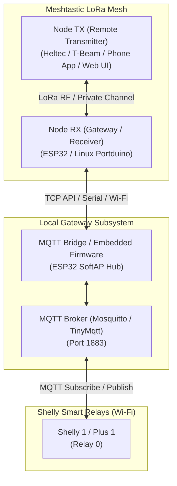

# Multi-Node Docker Testbed & IoT/MQTT Pipeline

This document outlines the architecture, data structures, and security specifications for using a **Meshtastic LoRa mesh network** to wirelessly control **Shelly smart relays** over MQTT via a Gateway node.

---

## 1. System Architecture



---

## 2. Technical Requirements & Security Design

### A. Data Structure (Payload Specification)
To keep LoRa payload sizes minimal (< 200 bytes) while enabling full validation and feedback, use compact JSON structures over a private channel (e.g. `SERIAL_APP` or `TEXT_MESSAGE_APP`).

#### Command Payload (Node TX ➔ Node RX)
```json
{
  "ver": 1,
  "target": "shelly1-sim01",
  "action": "ON",
  "seq": 1042,
  "sig": "9b9a4221"
}
```
* **`ver`**: Protocol version integer.
* **`target`**: Identifier of target device connected to MQTT broker.
* **`action`**: `ON`, `OFF`, or `TOGGLE`.
* **`seq`**: Monotonic counter / timestamp for anti-replay verification.
* **`sig`**: Truncated hex HMAC signature computed over `target + action + seq` with a shared secret key.

#### Response / Status ACK Payload (Node RX ➔ Node TX)
```json
{
  "ver": 1,
  "target": "shelly1-sim01",
  "state": "ON",
  "ack_seq": 1042,
  "status": "OK"
}
```

---

### B. Zero-Trust Security & Verification Pipeline

The gateway (`meshtasticd-config/mqtt_bridge.py`, or the standalone
`firmware/esp32-gateway/` firmware) treats **every** incoming mesh packet as
untrusted until it passes all three checks below, in order. Any failure
causes the packet to be **silently dropped** (no ACK, no error reply) so
that an attacker cannot use error responses to fingerprint the validation
logic.

1. **Sender Node ID Whitelist** (`Check 1/3`):
   - The gateway verifies the packet's `from` (Node ID, e.g. `!a1b2c3d4`)
     against a configured `allowed_nodes` list (`--allowed-nodes` CLI flag in
     `mqtt_bridge.py`, default `["*"]` for simulation/dev; a hardcoded C
     array in the ESP32 firmware for production).
   - Packets from unlisted senders are rejected before any further
     processing (cheap fail-fast rejection).
2. **Anti-Replay Protection (Monotonic Sequence Tracking)** (`Check 2/3`):
   - The gateway keeps an in-memory map of `last_seen_seq` per sender Node
     ID (`self.last_seen_seq[from_id]` in Python; a per-node array in the
     firmware).
   - A command is only accepted if `seq > last_seen_seq[from_id]`; otherwise
     it is rejected as a **replay attack** (a captured-and-resent packet, or
     an out-of-order/duplicate delivery).
   - Callers are expected to use a monotonically increasing value for
     `seq` (a simple incrementing counter or a Unix timestamp both work;
     `send_control_cmd.py --seq <int>` lets you override it explicitly for
     testing, and also exposes `--replay` / `--bad-sig` flags that
     deliberately violate checks 2 and 3 to verify the gateway rejects
     them).
3. **HMAC-SHA256 Signature (Cryptographic Authorization)** (`Check 3/3`):
   - Node TX and the Gateway share a secret key `CONTROL_SECRET` (from
     `.env` / `CONTROL_SECRET` env var, **never committed to git**).
   - The canonical signing string is built as
     `f"{target}:{action.upper()}:{seq}"` (colon-delimited, action
     upper-cased, `seq` as its decimal string representation).
   - The signature is the first **8 hex characters** (4 bytes) of
     `HMAC-SHA256(CONTROL_SECRET, canonical_string)`:
     ```python
     def compute_hmac_sig(secret: str, target: str, action: str, seq: int) -> str:
         canonical = f"{target}:{action.upper()}:{seq}"
         digest = hmac.new(secret.encode("utf-8"), canonical.encode("utf-8"), hashlib.sha256).hexdigest()
         return digest[:8]
     ```
     (verbatim from `meshtasticd-config/mqtt_bridge.py` /
     `meshtasticd-config/send_control_cmd.py`).
   - The gateway recomputes the expected signature and compares it to the
     received `sig` using a **constant-time comparison**
     (`hmac.compare_digest`, case-insensitive) to prevent timing-attack
     signature recovery. Any mismatch (including tampered `target`,
     `action`, or `seq`) is rejected.
   - Only after the signature check passes does `last_seen_seq[from_id]`
     get updated to the new `seq` - so a rejected/tampered packet can never
     advance a victim's sequence counter and invalidate their next
     legitimate command.
   - The ESP32 firmware performs the equivalent computation natively via
     `mbedtls/md.h`'s `mbedtls_md_hmac_*` API (see
     [`firmware/esp32-gateway/src/main.cpp`](../firmware/esp32-gateway/src/main.cpp)), producing byte-identical
     results to the Python implementation for the same secret/inputs.

Only once all three checks pass does the gateway publish the command to the
Shelly's MQTT topic and register a `pending_requests[target]` entry so the
subsequent Shelly state-change event can be matched back to the original
sender/seq for the ACK.

---

### C. Shelly Smart Relay MQTT Integration

#### Shelly Standard Topics:
* **Shelly Gen 1 (e.g. Shelly 1/1PM)**:
  * Command Topic: `shellies/shelly1-<device_id>/relay/0/command` (Payload: `on` or `off`)
  * State Topic: `shellies/shelly1-<device_id>/relay/0` (Payload: `on` or `off`)
* **Shelly Gen 2 / Plus Series (RPC Protocol)**:
  * Command Topic: `<device_id>/rpc` (Payload: `{"id":1,"src":"meshtastic","method":"Switch.Set","params":{"id":0,"on":true}}`)
  * Status Topic: `<device_id>/status/switch:0` (Payload: `{"output":true,...}`)

---

## 3. End-to-End Simulation Quickstart

> [!IMPORTANT]
> The Docker multi-container stack must be started **before** running `provision_nodes.py`, because the provisioner configures the live daemons over ports 4404 and 4406.

### Option A: Fully Simulated Multi-Node Stack (Docker)

```bash
# 1. Setup local environment and start Docker containers
cp .env.example .env
docker compose up -d

# 2. Auto-provision both simulated nodes (RX on port 4404, TX on port 4406)
python3 meshtasticd-config/provision_nodes.py --sim

# 3. In separate terminal tabs, start the Shelly simulator & MQTT bridge:
# Terminal 1: Run Shelly smart relay emulator
python3 meshtasticd-config/shelly_simulator.py --id shelly1-sim01

# Terminal 2: Run security gateway on the Gateway RX node
python3 meshtasticd-config/mqtt_bridge.py --mesh-port 4404
```

#### 4. Transmit Commands & Observe the Real-Time ACK

**Method 1: Automated Transmitter CLI (Recommended)**
Automatically computes HMAC-SHA256 signature and sequence counter:
```bash
# Turn ON:
python3 meshtasticd-config/send_control_cmd.py --mesh-port 4406 --target shelly1-sim01 --action ON

# Turn OFF:
python3 meshtasticd-config/send_control_cmd.py --mesh-port 4406 --target shelly1-sim01 --action OFF

# TOGGLE:
python3 meshtasticd-config/send_control_cmd.py --mesh-port 4406 --target shelly1-sim01 --action TOGGLE
```

**Method 2: Manual Payload from the Web UI Chat (`http://localhost:8081`)**
To test directly from the browser, paste one of the following JSON payloads into the **Remote TX** Web UI chat box:
```json
// Action: ON (seq: 1)
{"ver": 1, "target": "shelly1-sim01", "action": "ON", "seq": 1, "sig": "4605904e"}

// Action: OFF (seq: 2)
{"ver": 1, "target": "shelly1-sim01", "action": "OFF", "seq": 2, "sig": "65f04183"}

// Action: TOGGLE (seq: 3)
{"ver": 1, "target": "shelly1-sim01", "action": "TOGGLE", "seq": 3, "sig": "dade3a52"}
```
*(Note: Because of anti-replay protection, each subsequent command requires an incremented `seq` value and its corresponding HMAC signature computed from `CONTROL_SECRET`)*

---

### Option B: Physical Hardware Provisioning (USB)

```bash
# Auto-provision physical hardware node via USB:
python3 meshtasticd-config/provision_nodes.py --serial /dev/ttyUSB0 --role rx
```

---

## 4. Current Status & Verification Table

| Component | Status | Verification Details |
| :--- | :--- | :--- |
| **HMAC-SHA256 Auth** | ✅ Verified | Truncated hex signature verified against shared secret |
| **Anti-Replay Counter** | ✅ Verified | Reused/stale sequence numbers rejected |
| **Shelly Simulator** | ✅ Verified | Toggles relay state and emits Gen 1 / Gen 2 topics on `1883` |
| **Mesh Status ACK** | ✅ Verified | Bidirectional acknowledgment returned over mesh |
| **Automated Provisioning**| ✅ Verified | Reads `.env`, sets names, LoRa region, and MQTT module |
| **Simulated RF Cross-Routing** | ✅ Verified | `meshtasticd-config/sim_rf_bridge.py` cross-relays `SIMULATOR_APP` (portnum 69) packets between `ws-proxy-rx:4404` and `ws-proxy-tx:4404` mux ports, running as the `sim-radio-bridge` Docker service |
| **ESP32 Standalone Firmware** | ✅ Implemented & Verified | `firmware/esp32-gateway/` implements the same HMAC/anti-replay pipeline natively (SoftAP + `TinyMqtt` + `mbedtls`), matching the Python gateway specification |

---

## 5. Simulated RF TCP Cross-Routing Bridge

`meshtasticd -s` (`SimRadio`) has no radio-layer networking of its own - each
simulated node only loops a transmitted packet back out over its own
phone/API TCP connection, framed as a `SIMULATOR_APP` (portnum 69) packet.
To let the `meshtasticd-rx` and `meshtasticd-tx` Docker containers exchange
simulated LoRa RF traffic, `meshtasticd-config/sim_rf_bridge.py` runs as the
`sim-radio-bridge` service and:

1. Connects to each node's TCP **mux** port (`ws-proxy-rx:4404` and
   `ws-proxy-tx:4404` on the Docker network) - never directly to
   `meshtasticd-*:4403`, since that port only accepts a single client
   connection, which is already permanently held open by the corresponding
   `ws-proxy-*` container.
2. For every framed `FromRadio` protobuf received from one node's mux
   connection whose `packet.decoded.portnum == SIMULATOR_APP` (69), copies
   the entire `MeshPacket` into a `ToRadio.packet` and writes it, framed with
   the standard `0x94 0xC3` + 2-byte big-endian length header, into the
   *other* node's mux connection.
3. Applies basic loop prevention using a single anti-loop cache **shared
   across both directions**: once a given `(from, id)` packet has been
   relayed one way, it will not be relayed back the other way - including
   when the receiving node performs its own normal mesh-flood rebroadcast of
   that same packet id (which appears on its mux connection as a fresh
   outgoing `SIMULATOR_APP` frame carrying the same `from`/`id`). Using two
   independent per-direction caches instead of one shared cache was tried
   first and found to bounce rebroadcasts straight back to the sender,
   causing spurious anti-replay rejections at the MQTT bridge - see the
   verified end-to-end run below.

**Verified end-to-end** (`docker compose up -d --build`, then
`provision_nodes.py --sim`, then `shelly_simulator.py`, `mqtt_bridge.py
--mesh-port 4404`, and `send_control_cmd.py --mesh-port 4406 --target
shelly1-sim01 --action ON`): the TX packet was relayed over the bridge to
RX, validated (whitelist + anti-replay + HMAC), published to Mosquitto,
toggled the Shelly simulator, and the ACK was relayed back to TX, printing
`🎉 Status ACK Received via Meshtastic!`. The `--bad-sig` and `--replay`
flags were also confirmed to be silently dropped by the gateway (no ACK,
timeout message printed), and the existing test suite
(`.venv/bin/python3 -m unittest discover tests -v`) remained green (62/62) since the
bridge lives entirely in `meshtasticd-config/` and requires Docker/
`meshtastic` only at runtime, not at test-collection time.

### Pointing `mqtt_bridge.py` at a physical ESP32/LAN MQTT broker

`mqtt_bridge.py` already supports connecting to any broker on the LAN
instead of the Dockerized `mosquitto-broker` via its `--mqtt-host` and
`--mqtt-port` arguments (defaults: `localhost` / `1883`). To point it at a
physical ESP32-hosted broker (or any Mosquitto/broker reachable on your
network), run e.g.:

```bash
.venv/bin/python3 meshtasticd-config/mqtt_bridge.py \
  --mesh-port 4404 \
  --mqtt-host <ESP32_IP> \
  --mqtt-port 1883
```

Replace `<ESP32_IP>` with the ESP32 hub's LAN address (e.g. `192.168.1.50`
or its SoftAP address `192.168.4.1`). No code changes are required - this
is purely a command-line configuration switch.

---

## 6. Hybrid Testing: Simulated Mesh + Physical ESP32 SoftAP Broker

You do not need **physical Meshtastic LoRa radio hardware** to test the ESP32 Gateway firmware. You can keep the Docker-based simulated mesh (`meshtasticd-rx`/`tx`, `sim-radio-bridge`) running to generate LoRa traffic, while testing your **real physical ESP32 running `firmware/esp32-gateway`** acting as the SoftAP broker and security engine at `192.168.4.1:1883`. This validates the ESP32's `TinyMqtt` broker, its native C++ HMAC/anti-replay firmware logic, and the physical Shelly relay wiring before deploying physical LoRa radios.

1. **Flash and power on the ESP32** running
   `firmware/esp32-gateway/src/main.cpp` (see
   [`../firmware/esp32-gateway/README.md`](../firmware/esp32-gateway/README.md) for flashing steps). Confirm over
   serial that it prints its SoftAP SSID (`ESP32-Hub`) and IP
   (`192.168.4.1`).
2. **Join the ESP32's Wi-Fi network** from the machine running the Python
   tooling (or route to it) so `192.168.4.1:1883` is reachable.
3. **Start the Docker simulated-mesh stack** as usual so `meshtasticd-rx`
   and `meshtasticd-tx` can exchange simulated LoRa packets:
   ```bash
   docker compose up -d
   .venv/bin/python3 meshtasticd-config/provision_nodes.py --sim
   ```
   (You do **not** need to start the bundled `mqtt-broker` / `mosquitto`
   service for this hybrid test - the ESP32 is the broker.)
4. **Point the Shelly simulator at the ESP32 broker** instead of Mosquitto:
   ```bash
   .venv/bin/python3 meshtasticd-config/shelly_simulator.py \
     --host 192.168.4.1 --port 1883 --id shelly1-sim01
   ```
   (Or skip this step entirely and connect a **real Shelly** to
   `192.168.4.1:1883` as described in
   [`../firmware/esp32-gateway/README.md`](../firmware/esp32-gateway/README.md) §"Connecting a Real Shelly".)
5. **Send a signed command through the simulated mesh** with
   `send_control_cmd.py` exactly as in the fully-simulated flow (the
   ESP32 only needs to be reachable as the MQTT broker; the mesh transport
   itself is still the Docker `sim-radio-bridge`):
   ```bash
   .venv/bin/python3 meshtasticd-config/send_control_cmd.py \
     --mesh-port 4406 --target shelly1-sim01 --action ON
   ```
6. Optionally, run `mqtt_bridge.py` itself against the ESP32 broker (see
   the command above) instead of / alongside the ESP32's own native
   verification, to cross-check that both the Python and firmware HMAC
   implementations accept/reject the exact same packets.

**Expected result**: the ESP32 serial monitor logs the incoming signed
JSON command, the three security checks (whitelist / anti-replay / HMAC),
the outgoing `shellies/<id>/relay/0/command` publish, and the ACK it
publishes back once it observes the Shelly's `shellies/<id>/relay/0`
status topic change.
